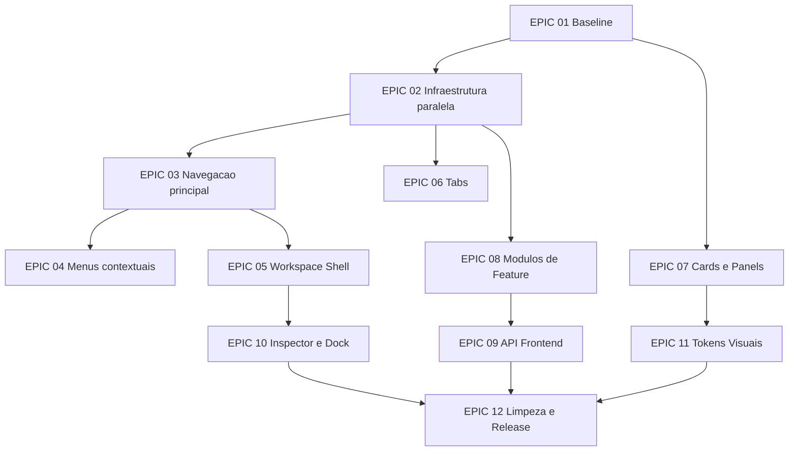

# Dependencias de Implementacao

## Grafo resumido

## Pode ser alterado isoladamente

| Item | Condicao |
| --- | --- |
| Baseline de rotas | Pode ser feito sem mudar codigo. |
| Contratos frontend/backend | Pode ser feito como documentacao ou teste. |
| Tipos de macro contexto | Desde que nao sejam consumidos pela UI. |
| Registry de navegacao | Desde que nao substitua `navTree`. |
| Esqueleto `features/*` | Desde que nao mova telas ainda. |
| Primitives de Card/Panel | Desde que nenhuma tela consuma antes da story de migracao. |
| Aliases de tokens | Desde que apontem para valores atuais. |

## Exige migracao conjunta controlada

| Grupo | Motivo | Stories |
| --- | --- | --- |
| Sidebar + adapter | Troca a fonte de dados da navegacao. | IMP-007, IMP-010, IMP-011 |
| Tabs + storage | Shape persistido pode quebrar usuario. | IMP-024, IMP-025, IMP-027 |
| Biblioteca + LessonRenderer | Detalhe dinamico depende de renderer existente. | IMP-032, IMP-037 |
| Repertorio + componentes musicais | Score/tab interativos tem estado local. | IMP-030, IMP-038 |
| API facade + modulos | Imports existentes dependem de `music-api.ts`. | IMP-041 a IMP-045 |
| Dock + Metronomo | Audio pode duplicar ciclo de vida. | IMP-033, IMP-047, IMP-048 |

## Contratos que nao podem quebrar

- Paths de rotas atuais.
- Endpoints `/api/v1`.
- Exports publicos de `src/lib/music-api.ts`.
- `WorkspaceProvider` e `useWorkspace`.
- Formato minimo de tab com `path` e `title`.
- Acesso a features pela Sidebar e Command Palette.
- Renderizacao dos componentes musicais existentes: `InteractiveTab`, `InteractiveScore`, `ExerciseRunner`, `AudioCuePlayer`, `PracticeRecorder`, `LessonRenderer`.

## Dependencias story a story

| Story | Depende de |
| --- | --- |
| IMP-001 | Nenhuma |
| IMP-002 | IMP-001 |
| IMP-003 | IMP-001 |
| IMP-004 | IMP-001 |
| IMP-005 | IMP-002 |
| IMP-006 | IMP-005 |
| IMP-007 | IMP-006 |
| IMP-008 | IMP-002 |
| IMP-009 | IMP-005 |
| IMP-010 | IMP-007 |
| IMP-011 | IMP-010 |
| IMP-012 | IMP-010 |
| IMP-013 | IMP-010 |
| IMP-014 | IMP-013 |
| IMP-015 | IMP-014 |
| IMP-016 | IMP-014 |
| IMP-017 | IMP-016 |
| IMP-018 | IMP-017 |
| IMP-019 | IMP-015 |
| IMP-020 | IMP-013 |
| IMP-021 | IMP-020 |
| IMP-022 | IMP-020 |
| IMP-023 | IMP-020 |
| IMP-024 | IMP-008 |
| IMP-025 | IMP-024 |
| IMP-026 | IMP-024 |
| IMP-027 | IMP-025 |
| IMP-028 | IMP-004 |
| IMP-029 | IMP-028 |
| IMP-030 | IMP-029 |
| IMP-031 | IMP-029 |
| IMP-032 | IMP-030 |
| IMP-033 | IMP-009 |
| IMP-034 | IMP-009, IMP-029 |
| IMP-035 | IMP-009 |
| IMP-036 | IMP-009 |
| IMP-037 | IMP-009, IMP-032 |
| IMP-038 | IMP-009, IMP-030 |
| IMP-039 | IMP-009, IMP-031 |
| IMP-040 | IMP-034, IMP-035, IMP-039 |
| IMP-041 | IMP-003 |
| IMP-042 | IMP-041 |
| IMP-043 | IMP-041, IMP-037 |
| IMP-044 | IMP-041, IMP-038, IMP-040 |
| IMP-045 | IMP-042, IMP-043, IMP-044 |
| IMP-046 | IMP-021 |
| IMP-047 | IMP-021, IMP-046 |
| IMP-048 | IMP-033, IMP-047 |
| IMP-049 | IMP-004 |
| IMP-050 | IMP-049 |
| IMP-051 | IMP-049, IMP-028 |
| IMP-052 | IMP-050, IMP-051 |
| IMP-053 | IMP-045, IMP-052 |
| IMP-054 | IMP-053 |
| IMP-055 | IMP-054, IMP-027, IMP-048 |
